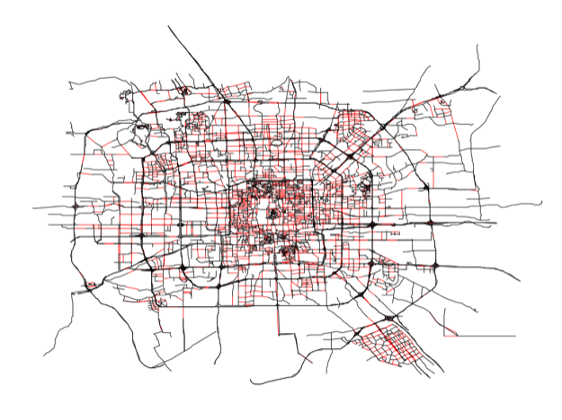

More Applications
-------------------

While a detailed discussion of all the things you can do with GTSAM will
take us too far, below is a small survey of what you can expect to do,
and which we did using GTSAM.

Conjugate Gradient Optimization
~~~~~~~~~~~~~~~~~~~~~~~~~~~~~~~~~~~

.. _Beijing:

    A map of Beijing, with a spanning tree shown in black, and
    the remaining *loop-closing* constraints shown in red. A spanning tree
    can be used as a *preconditioner* by GTSAM.

GTSAM also includes efficient preconditioned conjugate gradients (PCG)
methods for solving large-scale SLAM problems. While direct methods,
popular in the literature, exhibit quadratic convergence and can be
quite efficient for sparse problems, they typically require a lot of
storage and efficient elimination orderings to be found. In contrast,
iterative optimization methods only require access to the gradient and
have a small memory footprint, but can suffer from poor convergence. Our
method, *subgraph preconditioning*, explained in detail in [1]_ and [2]_, 
combines the advantages of direct
and iterative methods, by identifying a sub-problem that can be easily
solved using direct methods, and solving for the remaining part using
PCG. The easy sub-problems correspond to a spanning tree, a planar
subgraph, or any other substructure that can be efficiently solved. An
example of such a subgraph is shown in :numref:`Beijing`.

Visual Odometry
~~~~~~~~~~~~~~~~~~~

A gentle introduction to vision-based sensing is **Visual Odometry**
(abbreviated VO, see e.g. [3]_), which provides pose constraints between successive robot poses
by tracking or associating visual features in successive images taken by
a camera mounted rigidly on the robot. GTSAM includes both C++ and
MATLAB example code, as well as VO-specific factors to help you on the
way.

Visual SLAM
~~~~~~~~~~~~~~~

**Visual SLAM** (see e.g., [4]_)
is a SLAM variant where 3D points are observed by a camera as the camera
moves through space, either mounted on a robot or moved around by hand.
GTSAM, and particularly iSAM (see below), can easily be adapted to be
used as the back-end optimizer in such a scenario.

Fixed-lag Smoothing and Filtering
~~~~~~~~~~~~~~~~~~~~~~~~~~~~~~~~~~~~~

GTSAM can easily perform recursive estimation, where only a subset of
the poses are kept in the factor graph, while the remaining poses are
marginalized out. In all examples above we explicitly optimize for all
variables using all available measurements, which is called
**Smoothing** because the trajectory is “smoothed” out, and this is
where GTSAM got its name (GT *Smoothing* and Mapping). When instead only
the last few poses are kept in the graph, one speaks of **Fixed-lag
Smoothing**. Finally, when only the single most recent poses is kept,
one speaks of **Filtering**, and indeed the original formulation of SLAM
was filter-based [5]_.

Discrete Variables and HMMs
~~~~~~~~~~~~~~~~~~~~~~~~~~~~~~~

Finally, factor graphs are not limited to continuous variables: GTSAM
can also be used to model and solve discrete optimization problems. For
example, a Hidden Markov Model (HMM) has the same graphical model
structure as the Robot Localization problem from Section
`2 <#sec_Robot_Localization>`__, except that in an HMM the variables are
discrete. GTSAM can optimize and perform inference for discrete models.

.. [1] Dellaert, F., Carlson, J., Ila, V., Ni, K., and Thorpe, C.E., "Subgraph-preconditioned Conjugate Gradient for Large Scale SLAM", in IEEE/RSJ Intl. Conf. on Intelligent Robots and Systems (IROS) (2010).
.. [2] Jian, Y.-D., Balcan, D., and Dellaert, F., "Generalized Subgraph Preconditioners for Large-Scale Bundle Adjustment", in Intl. Conf. on Computer Vision (ICCV) (2011).
.. [3] Nistér, D., Naroditsky, O., and Bergen, J., "Visual Odometry", in IEEE Conf. on Computer Vision and Pattern Recognition (CVPR) vol. 1, (2004), pp. 652-659.
.. [4] Davison, A.J., "Real-Time Simultaneous Localisation and Mapping with a Single Camera", in Intl. Conf. on Computer Vision (ICCV) (2003), pp. 1403-1410.
.. [5] Smith, R., Self, M., and Cheeseman, P., "A stochastic map for uncertain spatial relationships", in Proc. of the Intl. Symp. of Robotics Research (ISRR) (1988), pp. 467-474.
